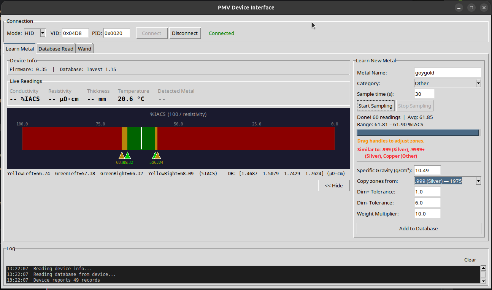

# PMV Flasher — Sigma Metalytics PMV GUI

A reverse-engineered GUI interface for the **Sigma Metalytics Precious Metal Verifier (PMV)** family of USB HID devices (Investor, Standard, Pro, Mini). Provides live measurement display, database management, metal learning, and wand probe integration.



https://github.com/user-attachments/assets/ea625671-c247-4810-8b95-9e3ec134fba9

## Disclaimer

This software is an **unofficial, third-party tool** created through reverse engineering of the PMV device protocol and its companion Windows software. It is **not affiliated with, endorsed by, or supported by Sigma Metalytics**.

Use at your own risk. Writing incorrect data to the device database could cause unexpected behavior. Always keep a backup of your original `.dat` database file before making changes. The authors accept no responsibility for damage to your device, data loss, or incorrect measurements.

The AES encryption key used by this tool was extracted from publicly available Sigma Metalytics software. This tool is intended for personal use by PMV device owners who want to manage their devices from Linux or customize their metal databases beyond what the official Windows-only software allows.

## Tested Devices

This tool has been developed and tested with the **PMV Investor** model. It should work with other PMV variants (Standard, Pro, Mini) as they share the same USB protocol and database format, but these have not been verified.

## Important Limitations

- **49-record maximum** — The device firmware (possibly!) only supports a maximum of 49 metal records in its database. The official Sigma Metalytics software enforces this same limit. The GUI enforces this limit on both "Add to Database" and "Save to Device" operations. There is an Experimental feature to allow past 49, this is not tested and it might corrupt your device! Use at your own peril.
- **Backup your database** — Before flashing any changes to the device, use "Save as .dat" to export a backup. The "Restore DB" button only reverts to the last state read from the device during the current session.
- **One connection at a time** — Do not run this tool simultaneously with the official Sigma Metalytics software or any other tool that communicates with the device.

## Running

### Windows

Double-click **`run.bat`** — it handles everything automatically:
1. Checks if Python is installed
2. If not, offers to install it via `winget` (or opens the download page)
3. Installs required packages (`pycryptodome`, `hidapi`)
4. Launches the GUI

### Linux

```bash
python3 pmv_gui.py
```

The bundled `Crypto/` folder includes the native extensions needed for Linux. The GUI will offer to install a udev rule for USB permissions if needed.

### Dependencies

- **Python 3.8+** with `tkinter`
- **PyCryptodome** — bundled in `Crypto/` for Linux; on Windows, `run.bat` installs it automatically (or run `pip install pycryptodome` manually)
- **hidapi** — Windows only; `run.bat` installs it automatically (or run `pip install hidapi` manually). Linux uses `/dev/hidraw` directly

## Files

```
pmv_gui.py        Main GUI application (Tkinter)
pmv_editor.py     Database model — .dat file encryption/decryption, Record/Database classes
pmv_upload.py     Transport layer — USB HID/TCP, packet builders, encryption helpers
Crypto/           Minimal PyCryptodome subset (AES-CBC only, Linux native extensions)
run.bat           Windows launcher — auto-detects/installs Python and dependencies
requirements.txt  Python package dependencies (for pip install)
README.md         This file
LICENSE           MIT License
```

## GUI Tabs

### Learn Metal
- **Live Readings**: conductivity (%IACS), resistivity (µΩ·cm), thickness (mm), temperature (°C)
- **Metal Detection**: auto-matches measurements against the Database Read tab records in real time; syncs the device screen to the detected metal (only when the database hasn't been edited)
- **Bar Meter**: 5-zone color display (red/yellow/green/yellow/red) with a red triangle indicator showing the current reading; during sampling shows the running min-max range; after sampling, threshold handles can be dragged to adjust zones
- **Computer-Side Database**: The database displayed in the Database Read tab is used as the reference for live metal detection. You can edit records, add new metals via the Learn panel, and build a custom database entirely on the computer — without flashing to the device. This lets you maintain a larger reference library for identification purposes while only flashing a curated set of up to 49 records to the device when needed. Use "Save as .dat" to save your working database to disk at any time.
- **Learn New Metal Panel** (slide-out):
  - Configurable sample time (default 30s)
  - 2-second sensor warmup before recording begins
  - IQR-based outlier removal on collected samples
  - Zone thresholds calculated from the mean of filtered samples
  - **Multi-scan support**: after a scan completes, click "Add Another Scan" to take additional measurements. Each scan is shown in a history table with its sample count, mean, and range. The final thresholds are calculated from the combined average of all scans. Use "Clear All" to start over.
  - "Copy zones from" dropdown applies zone spread percentages from an existing reference record and auto-fills Specific Gravity, Dim+/Dim- tolerances, and Weight Multiplier. Changing the reference after sampling recalculates zones and redraws the bar.
  - Warns (in red) if the sampled metal is similar to an existing database entry, and pre-fills values from the best match
  - Supports both main sensor and wand probe readings (wand overrides when connected)
  - Stop Sampling button; hiding the panel also stops sampling and clears the learn state
  - "Add to Database" saves the new record to the Database Read tab and resets the panel for the next metal

### Database Read
- Auto-reads all records from the device on connect (up to 49 records)
- Editable table — double-click any cell to modify (category uses a dropdown)
- **Save as .dat** — export the current table to an encrypted `.dat` file
- **Load from File** — import a `.dat` file into the table
- **Save to Device** — flash the current table to the device (blocked if over 49 records unless the experimental "Allow past 49 records" checkbox is enabled)
- **Restore DB** — revert to the original device data (appears after any edit, load, or flash)

### Device Info
- Query firmware version, device status, system info, and other diagnostic commands

## Device Protocol

The PMV communicates over USB HID (VID `0x04D8`, PID `0x0020`). Every command is a 64-byte AES-128-CBC encrypted packet. The device responds with 65 bytes (1-byte HID report ID + 64 bytes encrypted).

### Key Commands

| Cmd    | Name              | Purpose                                           |
|--------|-------------------|---------------------------------------------------|
| `0x04` | FIRMWARE_VER      | Firmware version string (handshake)               |
| `0x05` | STATUS            | Device status (handshake before flash)            |
| `0x09` | TEMPERATURE       | Float32 at byte 1 — probe temperature in °C      |
| `0x0a` | BEGIN_DB_DL       | Start database flash to device                    |
| `0x0b` | DB_RECORD         | Send one record during flash                      |
| `0x0c` | END_DB_DL         | Finish database flash                             |
| `0x14` | THICKNESS_DATA    | 9x float32 — field[3]=thickness, field[5]=resistivity |
| `0x1d` | SYSTEM_INFO       | Bytes 1-8 binary header, bytes 9+ = DB name ASCII |
| `0x1e` | SYSTEM_STATUS     | Float32 at byte 10 = wand resistivity (µΩ·cm)    |
| `0x22` | BEGIN_DB_UL       | Start reading database from device                |
| `0x23` | DB_RECORD_UL      | Read one record from device by index              |
| `0x24` | SET_METAL         | Set device screen to show a specific metal record |

### Measurement Units

- **Resistivity**: µΩ·cm (micro-ohm centimeters) — stored in DB thresholds and THICKNESS_DATA field[5]
- **Conductivity**: %IACS = `100 / resistivity` — displayed on the bar meter
- Bar meter is **reversed**: high %IACS on left, low on right (matches device screen)
- Bar range: 0–100 %IACS

### Zone Matching

For a resistivity reading against a record's threshold values [f1, f2, f3, f4]:
- `f2 <= res <= f3` = **GREEN** (genuine match)
- `f1 <= res < f2` or `f3 < res <= f4` = **YELLOW** (caution)
- Outside f1–f4 = **RED** (fail / no match)

### Wand Probe

The eddy current wand probe reading is at SYSTEM_STATUS (`0x1e`) byte offset 10, float32 in µΩ·cm. Valid range: 0.1–500. When available, the wand reading is preferred over the main sensor.

### Database Flash Protocol

Flashing a database to the device follows this sequence:
1. **Handshake**: FIRMWARE_VER (`0x04`) + STATUS (`0x05`)
2. **BEGIN** (`0x0a`): sends the database description (16 chars)
3. **RECORD** (`0x0b`) x N: sends each record (max 49)
4. **END** (`0x0c`): finalizes the upload

Live polling is paused during flash and resumed after completion.

## Linux USB Permissions

The GUI offers to install a udev rule on first device detection:
```
SUBSYSTEM=="hidraw", ATTRS{idVendor}=="04d8", ATTRS{idProduct}=="0020", MODE="0666"
```
After installing, unplug and replug the device.

